\

\

\<a href="[https://github.com/RaghavMaheshwari-tech](https://github.com/RaghavMaheshwari-tech)">
\
\</a>

\ \ 

\<a href="[https://www.linkedin.com/in/raghavmaheshwari-tech/](https://www.linkedin.com/in/raghavmaheshwari-tech/)">
\
\</a>
&nbsp;
\<a href="[https://github.com/RaghavMaheshwari-tech](https://github.com/RaghavMaheshwari-tech)">
\
\</a>
&nbsp;
\<a href="mailto:raghavmaheshwari945\@gmail.com">
\
\</a>

\

\ 

\---

\# ⚡ About Me

\

\

\

\`\`\`yaml
developer:
&#x20; name: "Raghav Maheshwari"
&#x20; education: "B.Tech @ MNIT Jaipur"
&#x20; specialization: "Minor in Computer Science & Engineering"

&#x20; interested\_in:
&#x20;   \- Software Development
&#x20;   \- Full-Stack Engineering
&#x20;   \- Backend Development
&#x20;   \- Data Structures & Algorithms
&#x20;   \- Scalable Applications

&#x20; currently\_exploring:
&#x20;   \- Advanced DSA
&#x20;   \- Backend Architecture
&#x20;   \- TypeScript
&#x20;   \- System Design
&#x20;   \- Database Design
&#x20;   \- Cloud & Deployment

&#x20; engineering\_with:
&#x20;   \- React.js
&#x20;   \- Node.js
&#x20;   \- Express.js
&#x20;   \- MongoDB
&#x20;   \- Redis
&#x20;   \- REST APIs

&#x20; competitive\_programming:
&#x20;   solved: "900+ Problems"
&#x20;   leetcode: "1611 Max Rating"
&#x20;   codeforces: "Pupil · 1229"

&#x20; mindset: "Learn deeply. Build practically. Improve continuously."
\`\`\`

\

\### \`Problem Solver\` × \`Full-Stack Developer\` × \`Backend Enthusiast\`

\ 

I enjoy building applications where \*\*frontend experience meets strong backend engineering\*\* — &#x20;
from REST APIs and authentication to databases, caching, payments and real-time workflows.

\

\ 

\---

\# ⚡ Developer Snapshot

\

\

\ \ 

\<table>
\<tr>

\<td align="center" width="20%">
\
\ 
\\<b>Problems Solved\</b>\
\</td>

\<td align="center" width="20%">
\
\ 
\\<b>Max Rating\</b>\
\</td>

\<td align="center" width="20%">
\
\ 
\\<b>Pupil\</b>\
\</td>

\<td align="center" width="20%">
\
\ 
\\<b>Full-Stack Builds\</b>\
\</td>

\<td align="center" width="20%">
\
\ 
\\<b>CGPA\</b>\
\</td>

\</tr>
\</table>

\ 

\### 🏆 Problem Solving

\`900+ DSA Problems\` &nbsp; • &nbsp; \`LeetCode 1611\` &nbsp; • &nbsp; \`Codeforces Pupil\`

\### ⚙️ Development

\`Full-Stack Development\` &nbsp; • &nbsp; \`Backend Engineering\` &nbsp; • &nbsp; \`REST APIs\`

\### 🧠 Core Engineering

\`DSA\` &nbsp; • &nbsp; \`OOP\` &nbsp; • &nbsp; \`DBMS\` &nbsp; • &nbsp; \`Operating Systems\`

\

\ 

\---

\# 🚀 Featured Engineering Projects

\## ⚔️ AlgoArena

\### Full-Stack Competitive Programming Platform

\> A production-style coding platform built around online code execution, contests, AI-assisted debugging, authentication, payments and administrative workflows.

\*\*Tech Stack:\*\* &#x20;
\`React.js\` · \`Node.js\` · \`Express.js\` · \`MongoDB\` · \`Redis\` · \`Judge0\` · \`Gemini API\` · \`Cloudinary\` · \`Tailwind CSS\`

\

\<a href="[https://algoarena.maheshwari.site/](https://algoarena.maheshwari.site/)">
\
\</a>
\<a href="[https://github.com/RaghavMaheshwari-tech/AlgoArena\_v2](https://github.com/RaghavMaheshwari-tech/AlgoArena_v2)">
\
\</a>
\<a href="[https://drive.google.com/file/d/1kwfJpuDGqfjuk0sdQL7ZRcMa7ozbn9uz/view](https://drive.google.com/file/d/1kwfJpuDGqfjuk0sdQL7ZRcMa7ozbn9uz/view)">
\
\</a>
\

\- ⚙️ Engineered \*\*37 Express REST endpoints\*\* for problem authoring, code submissions, user dashboards and role-based admin workflows.
\- ⚡ Integrated \*\*Judge0 batch execution\*\* for multi-language code evaluation with visible and hidden test cases.
\- 📊 Delivered automated verdicts, runtime analysis, memory tracking and complete submission history.
\- 🏁 Developed scheduled contests with protected problem visibility, submission deadlines, difficulty-weighted scoring and real-time leaderboards.
\- 🔐 Implemented \*\*Google OAuth 2.0, JWT, bcrypt, Redis token blacklisting and RBAC\*\*.
\- 🧠 Integrated \*\*Gemini API\*\* for context-aware hints and debugging assistance.
\- 💳 Secured Razorpay transactions using server-side \*\*HMAC signature verification\*\* and amount validation.

\ 

\---

\## 🏨 WanderLust

\### Full-Stack Property Booking Platform

\> A booking platform focused on secure authentication, reliable reservation workflows, server-side validation and payment integrity.

\*\*Tech Stack:\*\* &#x20;
\`React.js\` · \`Node.js\` · \`Express.js\` · \`MongoDB\` · \`Redis\` · \`Cloudinary\` · \`Tailwind CSS\`

\

\<a href="[https://wanderlust.maheshwari.site/](https://wanderlust.maheshwari.site/)">
\
\</a>
\<a href="[https://github.com/RaghavMaheshwari-tech/Wanderlust\_v2](https://github.com/RaghavMaheshwari-tech/Wanderlust_v2)">
\
\</a>
\<a href="[https://drive.google.com/file/d/1O08eKGDGht-\_TWX\_37R0Edvs5Y800FTR/view](https://drive.google.com/file/d/1O08eKGDGht-_TWX_37R0Edvs5Y800FTR/view)">
\
\</a>
\

\- 🏠 Built \*\*18 REST endpoints\*\* covering listings, reviews, bookings, filtering, pagination and user-specific dashboards.
\- 🔐 Designed secure authentication using \*\*JWT, bcrypt and Redis token blacklisting\*\*.
\- 🛡️ Implemented ownership-based authorization to protect user-specific resources.
\- 📅 Recalculated dates, nights, taxes and booking prices entirely \*\*server-side\*\*.
\- ⚡ Used \*\*Redis\*\* for temporary booking sessions and rate limiting.
\- 💳 Implemented \*\*HMAC signature verification\*\* before persisting Razorpay transactions.
\- ☁️ Maintained data integrity through cascading deletion of related reviews and Cloudinary assets.

\ 

\---

\## 🍔 Food Delivery Web Application

\### Swiggy-Inspired Real-Time Food Discovery UI

\> A responsive food discovery application built around real-time APIs, centralized state management and optimized frontend experiences.

\*\*Tech Stack:\*\* &#x20;
\`React.js\` · \`Redux Toolkit\` · \`React Router\` · \`Tailwind CSS\` · \`Parcel\` · \`REST APIs\`

\

\<a href="[https://swiggy.maheshwari.site/](https://swiggy.maheshwari.site/)">
\
\</a>
\<a href="[https://github.com/RaghavMaheshwari-tech/Food-Delivery-Web-App\_v2](https://github.com/RaghavMaheshwari-tech/Food-Delivery-Web-App_v2)">
\
\</a>
\<a href="[https://drive.google.com/file/d/1dMe9294HuiSRO9JA2sNOuTKbPcc0H\_YU/view](https://drive.google.com/file/d/1dMe9294HuiSRO9JA2sNOuTKbPcc0H_YU/view)">
\
\</a>
\

\- 🌐 Integrated live third-party \*\*REST APIs\*\* to fetch and render production restaurant data.
\- 🛒 Built centralized application state and shopping-cart workflows using \*\*Redux Toolkit\*\*.
\- 🔀 Implemented dynamic routing and cross-component state synchronization.
\- 🔎 Developed restaurant discovery and efficient client-side filtering.
\- ✨ Improved perceived load times using custom \*\*Shimmer UI placeholders\*\*.

\ 

\---

\# 🛠️ Technical Arsenal

\

\## 💻 Languages

\

\ \ 

\
\
\
\
\

\ \ 

\## 🎨 Frontend Engineering

\

\ \ 

\
\
\
\
\
\

\ \ 

\## ⚙️ Backend Engineering

\

\ \ 

\
\
\
\
\
\

\ \ 

\## 🗄️ Databases & Caching

\

\ \ 

\
\
\

\ \ 

\## 🤖 APIs & Integrations

\
\
\

\ \ 

\## 🔧 Developer Tools

\

\ \ 

\
\
\

\ \ 

\## 🧠 Core Computer Science

\
\
\
\
\

\

\ 

\---

\# 🧠 Engineering Interests

\

\### \`Data Structures & Algorithms\`

\### \`Full-Stack Engineering\` • \`Backend Development\`

\### \`Database Design\` • \`REST API Architecture\`

\### \`Authentication & Authorization\` • \`Caching\`

\### \`Performance\` • \`Scalability\` • \`System Design\`

\ 

\> \*\*I enjoy understanding not only how software works, but how to design it better.\*\*

\

\ 

\---

\# 🏆 Milestones

\

\<table>

\<tr>

\<td align="center">
\<h3>🧩 900+\</h3>
\<b>DSA Problems\</b>
\ 
\Solved across platforms\
\</td>

\<td align="center">
\<h3>🟠 1611\</h3>
\<b>LeetCode\</b>
\ 
\Maximum Rating\
\</td>

\<td align="center">
\<h3>🔵 Pupil\</h3>
\<b>Codeforces\</b>
\ 
\Maximum Rating 1229\
\</td>

\<td align="center">
\<h3>🎓 8.50\</h3>
\<b>MNIT Jaipur\</b>
\ 
\Current CGPA\
\</td>

\</tr>

\</table>

\

\ 

\

\
\<b>⚡ Competitive Programming\</b>\

\ 

\- 🧩 Solved \*\*900+ Data Structures & Algorithms problems\*\*
\- 🟠 Achieved a \*\*LeetCode Max Rating of 1611\*\*
\- 🔵 Achieved \*\*Codeforces Pupil\*\* with a maximum rating of \*\*1229\*\*
\- 🧠 Regularly practice algorithmic problem solving and competitive programming

\

\

\
\<b>🎓 Academics & Leadership\</b>\

\ 

\- 🎓 Pursuing \*\*B.Tech at MNIT Jaipur\*\*
\- 💻 Minor specialization in \*\*Computer Science & Engineering\*\*
\- 📊 Current \*\*CGPA — 8.50\*\*
\- 📚 Class XII — \*\*92.2%\*\*
\- 📚 Class X — \*\*95.6%\*\*
\- 👔 \*\*Executive — Think India Club\*\*
\- ⚙️ Coordinated technical events as part of the club

\

\ 

\---

\# 📊 Developer Activity

\

\<picture>
&#x20; \<source
&#x20;   media="(prefers-color-scheme: dark)"
&#x20;   srcset="./assets/activity/contributions.dark.svg"
&#x20; />
&#x20; \<source
&#x20;   media="(prefers-color-scheme: light)"
&#x20;   srcset="./assets/activity/contributions.light.svg"
&#x20; />
&#x20; \
\</picture>

\ \ 

\<picture>
&#x20; \<source
&#x20;   media="(prefers-color-scheme: dark)"
&#x20;   srcset="./assets/activity/rhythm.dark.svg"
&#x20; />
&#x20; \<source
&#x20;   media="(prefers-color-scheme: light)"
&#x20;   srcset="./assets/activity/rhythm.light.svg"
&#x20; />
&#x20; \
\</picture>

\ \ 

\<picture>
&#x20; \<source
&#x20;   media="(prefers-color-scheme: dark)"
&#x20;   srcset="./assets/activity/composition.dark.svg"
&#x20; />
&#x20; \<source
&#x20;   media="(prefers-color-scheme: light)"
&#x20;   srcset="./assets/activity/composition.light.svg"
&#x20; />
&#x20; \
\</picture>

\

\ 

\---

\# 🐍 Contribution Flow

\

\<picture>
&#x20; \<source
&#x20;   media="(prefers-color-scheme: dark)"
&#x20;   srcset="./assets/activity/github-snake-dark.svg"
&#x20; />
&#x20; \<source
&#x20;   media="(prefers-color-scheme: light)"
&#x20;   srcset="./assets/activity/github-snake-light.svg"
&#x20; />
&#x20; \
\</picture>

\

\ 

\ 

\---

\# 🤝 Let's Connect

\

\

\ 

\<a href="[https://www.linkedin.com/in/raghavmaheshwari-tech/](https://www.linkedin.com/in/raghavmaheshwari-tech/)">
\
\</a>

\<a href="mailto:raghavmaheshwari945\@gmail.com">
\
\</a>

\<a href="[https://github.com/RaghavMaheshwari-tech](https://github.com/RaghavMaheshwari-tech)">
\
\</a>

\ \ 

\### \`while(alive) { learn(); build(); debug(); improve(); }\`

\ 

\

\

ek bar check kr or then full code de finally
